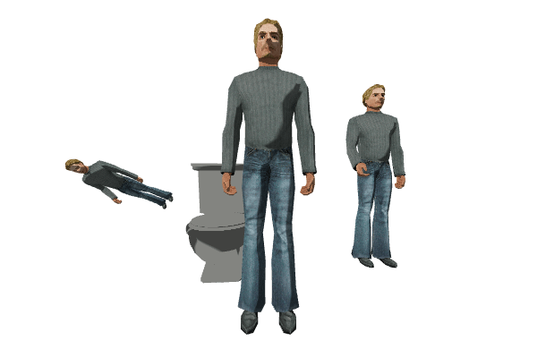

# WebGL-based handmade 3D render engine

This project based purely on enthusiasm.

## Purpose of this project

I set myself the goal of creating a high-performance 3D engine for browsers.
It should be relatively simple, but at same time allow to do great stuff with it.

The main goals:

- lightweight 3d render engine
- toolchain for resource processing (mainly optimizing)

## Features

- [x] Shadows
- [x] Skeletal animation
- [x] glTF models loader
- [x] Heightmap based terrains

## Demonstration

## Docs:

- [Next and already done features](./TODO.md)
- [Information related to Shading](./SHADING.md)
- [Resouces](./RESOURCES.md)
